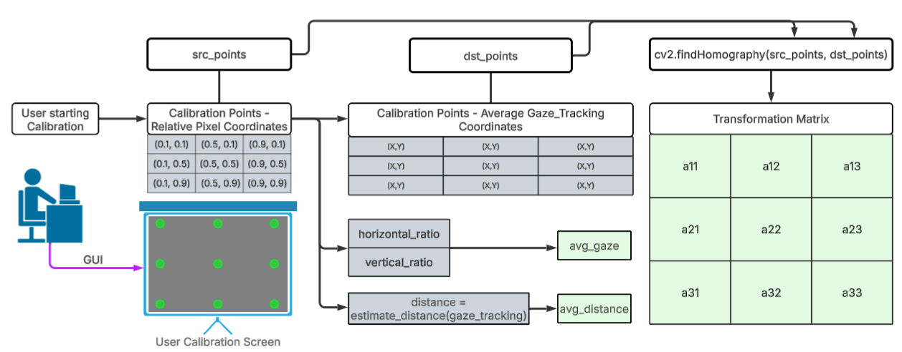
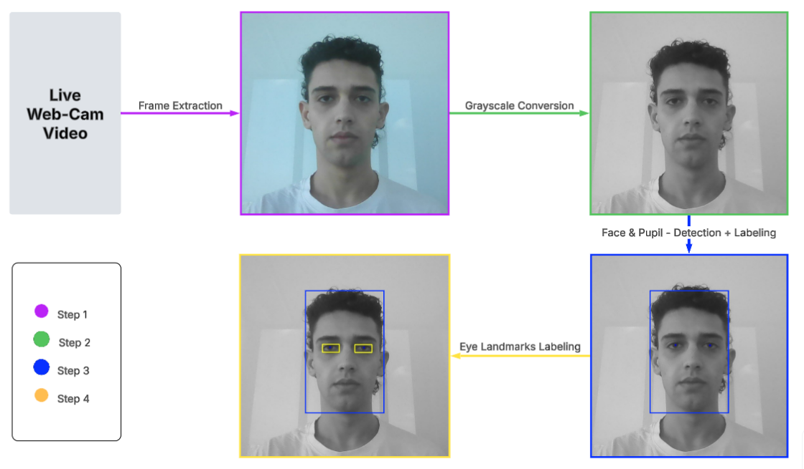
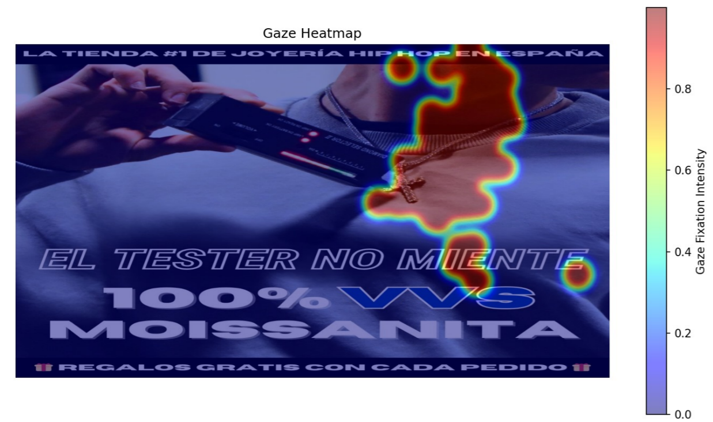

# Gaze-Tracking Application

## Overview

This application captures real-time gaze data using your webcam, guides you through a calibration process, and visualizes your gaze activity as a heatmap over a displayed advertisement. The system maps gaze points to screen coordinates and provides insights into how users view visual content.

## 📁 Project Structure
``` css
📂 Computer-Vision/
├── 📂 data/  
│  ├── 📜 ad1.jpg
│  ├── 📜 ad2.jpg
│  ├── 📜 ...
│  └── 📜 ad9.jpg      
│
├── 📂 src/ # Main Code Folder.  
|  ├── 📂 ad_tracking/ 
|  │  ├── 📜 ad.py
|  │  ├── 📜 calibrate.py
|  │  └── 📜 camera.py
|  |        
|  ├── 📂 gaze_tracking/ 
|  │  ├── 📜 __init__.py
|  │  ├── 📜 calibration.py
|  │  ├── 📜 eye.py
|  │  ├── 📜 gaze_tracking.py
|  │  ├── 📜 pupil.py
|  |  └── 📂trained_models/
|  |  |  └── 📜 shape_predictor_68_face_landmarks.dat
|  |
|  ├── 📂 utils/
|  |  └── 📜 ui_utils.py
|  |
|  └── 📜 main.py
|
├── 📂 tests/
│  ├── 📜 test_ad.py
│  ├── 📜 test_calibrate.py
│  ├── 📜 test_create_heatmap.py
│  ├── 📜 test_grid_mapping.py
│  ├── 📜 test_screenres.py
│  ├── 📜 test_show_heatmap.py
│  ├── 📜 test_transformation_matrix.py
│  └── 📜 test_all.py
|
├── 📜 .DS_Store
├── 📜 .gitignore
├── 📜 README.md
└── 📜 requirements.txt      
           
```
## Features

- **Live Video Capture:** Initializes the webcam and captures live video feed.
- **Calibration Process:** Prompts the user to look at a grid of points for calibration.
- **Real-Time Gaze Tracking:** Tracks and maps gaze points to screen coordinates.
- **Heatmap Visualization:** Generates and displays a heatmap based on gaze activity.
- **Advertisement Display:** Shows an advertisement in full-screen mode after calibration.

---

## Installation

### Prerequisites

- Python 3.7–3.10 recommended  
- A working webcam  
- OS: Windows, macOS, or Linux  
- (Optional) [Anaconda](https://www.anaconda.com/) environment for easier dependency management

---

### 1. Clone the Repository

```bash
git clone <repository-url>
cd Computer-Vision
```
### 2. Create a Virtual Environment
2.1 - Create a virtual environment named 'venv' (make sure you are inside `Computer-Vision/` ):
```bash
python -m venv venv
```

2.2 - Activate the virtual environment:
```bash
source venv/bin/activate
```

2.3 - You can optionally add this command after activation to confirm your venv is working:
```bash
which python
```

### 3. Install Dependencies
Use `pip` with the provided `requirements.txt`:
```bash
pip install -r requirements.txt
```
Some users may experience issues installing the `dlib` library, which is required for facial landmark detection. If so, try one of the following options:

Option A: Using Conda
```bash
conda install -c conda-forge dlib
```

Option B: Using a Precompiled Wheel

Download and install a precompiled .whl file compatible with your Python version from Gohlke's repository:
https://www.lfd.uci.edu/~gohlke/pythonlibs/#dlib

and place it in your Computer-Vision folder. then run:
```bash
pip install <downloaded-filename>.whl
```

## Usage

### Step 1: Setup
* Make sure you’re in the project’s root directory.
* Ensure that a working webcam is connected and accessible.

### Step 2: Run the Application
The main script is located in the `src/` directory. Launch it with:
```bash
python src/main.py
```

Upon launch, the user will reach the home manue where he/she be prompted to run the calibration first. 
The user will be promped to look at a grid of points to calibrate gaze detection. 
This calibration helps the system accurately map your gaze to screen coordinates.

---
## Troubleshooting

Issue	Solution
ModuleNotFoundError: cv2	Run pip install opencv-python
dlib fails to install	Use Python 3.11 and run: brew install cmake && pip install dlib
Webcam shows black screen	Try changing lighting, or test with python -m cv2
Gaze not accurate	Re-run calibration, adjust distance or lighting

---

### 🔄 Calibration and Coordinate Mapping Flow

  

*Figure 1: Calibration process mapping screen-relative points to gaze-tracked coordinates and generating a homography transformation matrix.*

---
### 🎯 Gaze Tracking Pipeline



*Figure 2: Step-by-step frame processing — from webcam capture to eye landmark detection.*

---

### 🔥 Example Output - Gaze Heatmap
 

*Figure 3: Gaze heatmap generated over an advertisement, visualizing fixation intensity across screen regions.*

## License
MIT License

## Contributions
• @inds123
• @shahafbr
• @ayayasminebelloum
• @makiwarner

=======
# Gaze-Tracking Application

## Overview

This application captures real-time gaze data using your webcam, guides you through a calibration process, and visualizes your gaze activity as a heatmap over a displayed advertisement. The system maps gaze points to screen coordinates and provides insights into how users view visual content.

## 📁 Project Structure
``` css
📂 Computer-Vision/
├── 📂 data/  
│  ├── 📜 ad1.jpg
│  ├── 📜 ad2.jpg
│  ├── 📜 ...
│  └── 📜 ad9.jpg      
│
├── 📂 src/ # Main Code Folder.  
|  ├── 📂 ad_tracking/ 
|  │  ├── 📜 ad.py
|  │  ├── 📜 calibrate.py
|  │  └── 📜 camera.py
|  |        
|  ├── 📂 gaze_tracking/ 
|  │  ├── 📜 __init__.py
|  │  ├── 📜 calibration.py
|  │  ├── 📜 eye.py
|  │  ├── 📜 gaze_tracking.py
|  │  ├── 📜 pupil.py
|  |  └── 📂trained_models/
|  |  |  └── 📜 shape_predictor_68_face_landmarks.dat
|  |
|  ├── 📂 utils/
|  |  └── 📜 ui_utils.py
|  |
|  └── 📜 main.py
|
├── 📂 tests/
│  ├── 📜 test_ad.py
│  ├── 📜 test_calibrate.py
│  ├── 📜 test_create_heatmap.py
│  ├── 📜 test_grid_mapping.py
│  ├── 📜 test_screenres.py
│  ├── 📜 test_show_heatmap.py
│  ├── 📜 test_transformation_matrix.py
│  └── 📜 test_all.py
|
├── 📜 .DS_Store
├── 📜 .gitignore
├── 📜 README.md
└── 📜 requirements.txt      
           
```
## Features

- **Live Video Capture:** Initializes the webcam and captures live video feed.
- **Calibration Process:** Prompts the user to look at a grid of points for calibration.
- **Real-Time Gaze Tracking:** Tracks and maps gaze points to screen coordinates.
- **Heatmap Visualization:** Generates and displays a heatmap based on gaze activity.
- **Advertisement Display:** Shows an advertisement in full-screen mode after calibration.

---

## Installation

### Prerequisites

- Python 3.7–3.10 recommended  
- A working webcam  
- OS: Windows, macOS, or Linux  
- (Optional) [Anaconda](https://www.anaconda.com/) environment for easier dependency management

---

### 1. Clone the Repository

```bash
git clone <repository-url>
cd Computer-Vision
```
### 2. Create a Virtual Environment
2.1 - Create a virtual environment named 'venv' (make sure you are inside `Computer-Vision/` ):
```bash
python -m venv venv
```

2.2 - Activate the virtual environment:
```bash
source venv/bin/activate
```

2.3 - You can optionally add this command after activation to confirm your venv is working:
```bash
which python
```

### 3. Install Dependencies
Use `pip` with the provided `requirements.txt`:
```bash
pip install -r requirements.txt
```
Some users may experience issues installing the `dlib` library, which is required for facial landmark detection. If so, try one of the following options:

Option A: Using Conda
```bash
conda install -c conda-forge dlib
```

Option B: Using a Precompiled Wheel

Download and install a precompiled .whl file compatible with your Python version from Gohlke's repository:
https://www.lfd.uci.edu/~gohlke/pythonlibs/#dlib

and place it in your Computer-Vision folder. then run:
```bash
pip install <downloaded-filename>.whl
```

## Usage

### Step 1: Setup
* Make sure you’re in the project’s root directory.
* Ensure that a working webcam is connected and accessible.

### Step 2: Run the Application
The main script is located in the `src/` directory. Launch it with:
```bash
python src/main.py
```

Upon launch, the user will reach the home manue where he/she be prompted to run the calibration first. The user will be promped to look at a grid of points to calibrate gaze detection. This calibration helps the system accurately map your gaze to screen coordinates.

---

### 🔄 Calibration and Coordinate Mapping Flow

  

*Figure 1: Calibration process mapping screen-relative points to gaze-tracked coordinates and generating a homography transformation matrix.*

---
### 🎯 Gaze Tracking Pipeline


*Figure 2: Step-by-step frame processing — from webcam capture to eye landmark detection.*

---

### 🔥 Example Output - Gaze Heatmap
 

*Figure 3: Gaze heatmap generated over an advertisement, visualizing fixation intensity across screen regions.*

## License
MIT License

## Contributions
Feel free to submit issues or pull requests. Contributions are welcome!